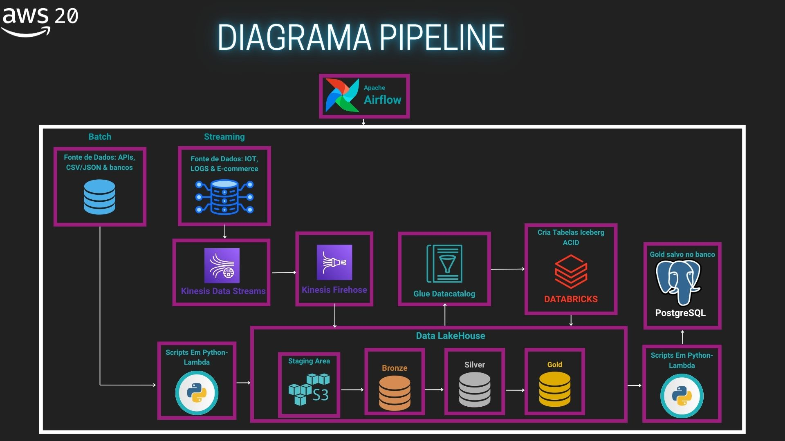
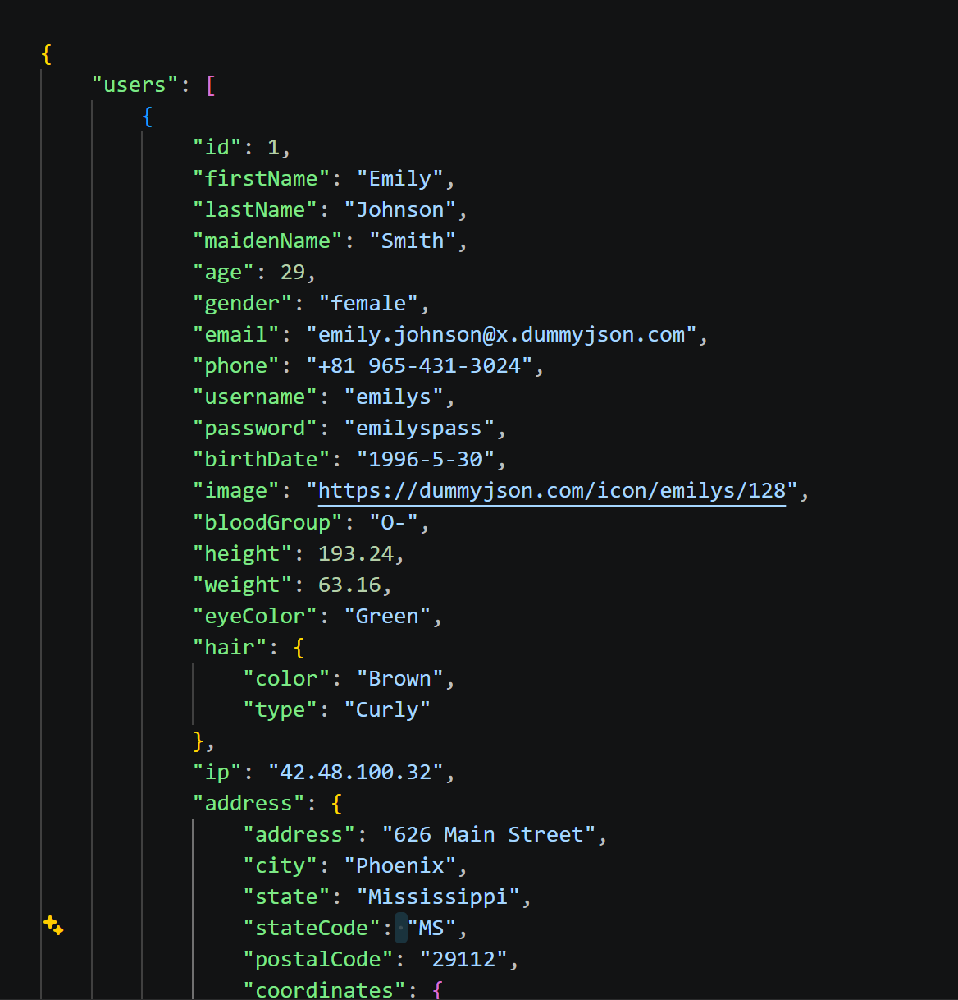
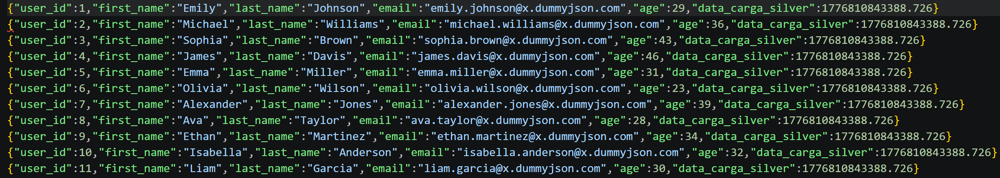
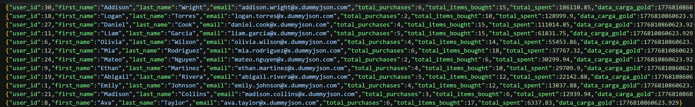

# Data Lakehouse Pipeline: Engenharia de Dados Cloud-Ready

Este projeto apresenta um pipeline analítico de e-commerce, desenvolvido em Python e executado localmente com Docker. A solução segue a arquitetura **Medallion**, organizando os dados nas camadas Bronze, Silver e Gold para demonstrar um fluxo completo de ingestão, transformação e disponibilização.

O objetivo é mostrar como uma solução de dados pode ser estruturada de forma modular, observável e preparada para evoluir de um ambiente local para serviços gerenciados em nuvem. O MVP implementa o processamento em lote de ponta a ponta; o diagrama também apresenta como a solução poderia evoluir para um ambiente cloud com processamento streaming.

Este projeto foi originalmente desenvolvido como um teste de processo seletivo para uma empresa. O material foi adaptado para compor meu portfólio, preservando a solução técnica e os recursos que ajudam a demonstrar seu funcionamento.

## Materiais complementares

- [Vídeo demonstrativo da solução](https://drive.google.com/file/d/1PFWiAQ80eX94vjKuHrJc8xdC8XbwH2oY/view?usp=sharing): mantido para mostrar o pipeline em funcionamento. A demonstração prática começa em aproximadamente 7:40.
- [Apresentação do projeto](https://www.canva.com/design/DAHHcN9NVeo/RkxqGowMTakAw993z5R8yQ/edit)

## Visão geral

- Ingestão de dados de uma API pública de e-commerce.
- Armazenamento do dado bruto na camada Bronze.
- Limpeza, padronização e conversão para Parquet na camada Silver.
- Modelagem e agregações analíticas na camada Gold.
- Orquestração do fluxo com Apache Airflow.
- Disponibilização dos dados analíticos em PostgreSQL para consumo por ferramentas de BI.

## Escopo implementado

O pipeline executado neste repositório cobre o fluxo batch completo: extração de dados da API, organização na camada Bronze, tratamento na Silver, agregações na Gold e carga final no PostgreSQL. O Airflow pode orquestrar essas mesmas etapas por meio da DAG `pipeline_ecommerce_medallion`.

Streaming, S3, Kinesis, Glue, Databricks, Iceberg e Lambda aparecem como componentes de uma arquitetura cloud de referência. Eles não são executados pelo MVP local.

## Arquitetura do projeto

O diagrama representa a arquitetura de referência e mostra o fluxo batch implementado junto com uma possível evolução para streaming. As tecnologias cloud ilustradas devem ser entendidas como propostas de produção, enquanto a execução atual acontece localmente com Python, Docker, Airflow e PostgreSQL.



---

## Fluxo de transformação dos dados

As imagens abaixo mostram o resultado de cada etapa do pipeline. Os arquivos Parquet são apresentados em formato JSON apenas para facilitar a visualização no repositório.

### 1. Bronze: dados brutos
Dados extraídos da API e preservados no formato original.


### 2. Silver: dados tratados
Dados tipados, padronizados e convertidos para o formato Parquet.


### 3. Gold: dados analíticos
Dados modelados e preparados para consultas e indicadores de negócio.


---

## Decisões arquiteturais e stack tecnológica

As escolhas técnicas priorizam modularidade, baixo acoplamento, facilidade de execução e possibilidade de migração para uma arquitetura gerenciada.

### Orquestração: Apache Airflow
O Airflow coordena as dependências entre ingestão, transformação e carga, além de oferecer retentativas e monitoramento visual. Em uma implantação AWS, essa função poderia ser executada pelo Amazon MWAA.

### Ingestão batch: Python
Scripts Python fazem a extração da API e permitem aplicar regras de tratamento específicas com controle explícito de erros. Em um ambiente AWS, essa etapa poderia ser executada com AWS Lambda.

### Evolução para streaming: Amazon Kinesis
O streaming não faz parte do MVP atual. Em uma evolução da solução, o Amazon Kinesis poderia receber eventos de alto volume e baixa latência. O Data Streams desacoplaria produtores e consumidores, enquanto o Firehose poderia entregar os eventos ao data lake.

### Evolução do armazenamento: Amazon S3 e arquitetura Medallion
No MVP, as camadas são geradas localmente para facilitar a execução e a demonstração. Em uma implantação em nuvem, o Amazon S3 poderia armazenar grandes volumes de objetos com alta durabilidade e baixo custo operacional. As camadas do lakehouse poderiam ser organizadas da seguinte forma:

- **Staging:** área temporária para receber os dados.
- **Bronze:** preserva os dados brutos, mantendo o histórico e permitindo reprocessamentos.
- **Silver:** contém dados limpos, tipados e armazenados em Parquet para melhorar a compressão e o desempenho das consultas.
- **Gold:** reúne dados modelados e agregados para análise e consumo pelas áreas de negócio.

### Evolução do processamento e da governança: Spark, Iceberg e AWS Glue
As transformações do MVP são executadas localmente com Python e pandas. Caso o volume de dados cresça, a arquitetura pode evoluir para o processamento distribuído com Apache Spark ou Databricks. Apache Iceberg pode adicionar transações ACID, evolução de schema e histórico de versões às tabelas do lakehouse. Nesse cenário, o AWS Glue Data Catalog centralizaria os metadados e facilitaria a descoberta e a governança dos dados.

### Consumo: PostgreSQL
O PostgreSQL recebe os dados da camada Gold e oferece uma interface simples para consultas analíticas e integração com ferramentas como Power BI e Metabase. Essa escolha também torna o MVP fácil de executar localmente com Docker. Em produção, a mesma camada poderia ser disponibilizada por um serviço gerenciado, como o Amazon Aurora, ou consultada diretamente no lakehouse por meio de ferramentas como o Amazon Athena.

---

## Como executar localmente

O ambiente é encapsulado com Docker Compose para reduzir a quantidade de dependências locais e reproduzir o pipeline de forma consistente.

### Pré-requisitos

- Docker e Docker Compose.
- Git.

### Passo a passo

1. Clone este repositório:

   ```bash
   git clone https://github.com/vagnero/Desafio-Tecnico-Engenheiro-de-Dados-Cloud-Ready.git
   cd Desafio-Tecnico-Engenheiro-de-Dados-Cloud-Ready
   ```

2. Crie um arquivo `.env` na raiz do projeto com:

   ```env
   API_BASE_URL=https://dummyjson.com
   DB_HOST=localhost
   DB_PORT=5433
   DB_USER=airflow
   DB_PASS=airflow
   DB_NAME=camada_gold
   ```


3. Construa as imagens:

   ```bash
   docker-compose build
   ```

4. Inicie o Airflow e o PostgreSQL:

   ```bash
   docker-compose up -d
   ```

5. Acesse o Airflow em `http://localhost:8080` usando `admin` como usuário e senha.

6. Na lista de DAGs, ative `pipeline_ecommerce_medallion` e clique em **Trigger** para iniciar o pipeline.

7. Valide os resultados no PostgreSQL usando DBeaver, pgAdmin ou outra ferramenta de sua preferência:

   - Host: `localhost`
   - Porta: `5433`
   - Database: `camada_gold`
   - Usuário: `airflow`
   - Senha: `airflow`

## Estrutura do projeto

```text
dags/       Orquestração do pipeline com Airflow
src/        Extração, transformações e carga dos dados
src/images/ Diagramas e evidências das transformações
```